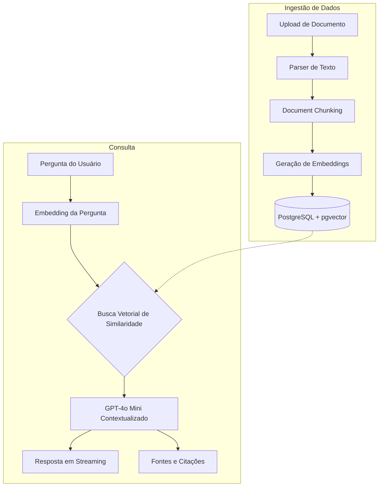

# 🪐 Atlas

**Transformando documentos estáticos em inteligência viva.**
O Atlas é uma plataforma avançada que revoluciona o acesso ao conhecimento corporativo. Ele permite que organizações transformem manuais, processos e políticas em uma base de conhecimento interativa, respondendo perguntas em tempo real com alta precisão e citando as fontes exatas da informação.

🌍 **Acesso Rápido (Produção)**: [https://atlas-leapy.vercel.app/](https://atlas-leapy.vercel.app/)

## 2. Visão Geral

O Atlas é uma plataforma SaaS (Software as a Service) estruturada sobre a arquitetura RAG (Retrieval-Augmented Generation).
Em muitas empresas, o conhecimento interno fica fragmentado e perdido em milhares de arquivos PDF, DOCX e textos soltos, gerando ineficiência e perda de tempo em buscas manuais. O Atlas resolve esse problema absorvendo esses documentos e utilizando Inteligência Artificial para compreender o contexto, permitindo que qualquer colaborador converse diretamente com a base de conhecimento e receba respostas exatas, sempre acompanhadas da fonte.

## 3. Arquitetura

O fluxo de dados da aplicação foi desenhado para garantir isolamento Multi-Tenant e alta performance vetorial.



## 4. Como Funciona

O fluxo completo da aplicação pode ser dividido em 8 etapas centrais:

1. **Upload do documento**: O usuário anexa um arquivo através da UI de Knowledge Base.
2. **Extração de texto**: Parsers de back-end processam o arquivo nativamente, independente do formato, extraindo apenas o texto útil.
3. **Chunking**: O texto massivo é fatiado em pequenos blocos semânticos (chunks) com sobreposição para manter o contexto.
4. **Embeddings**: Cada bloco é convertido em um vetor matemático utilizando os modelos da OpenAI.
5. **Indexação**: Os vetores e seus metadados são gravados em um banco PostgreSQL utilizando a extensão `pgvector`.
6. **Busca vetorial**: Quando uma pergunta é feita no chat, ela também vira um vetor, e o banco faz uma busca de similaridade (Cosine Similarity) para achar os chunks mais relevantes.
7. **Geração da resposta**: O contexto recuperado é injetado no prompt do modelo de linguagem (GPT-4o Mini), gerando a resposta progressivamente.
8. **Exibição das fontes**: Junto com a resposta, o usuário recebe links clicáveis que mostram a confiança e o trecho exato do documento original que embasou aquela resposta.

## 5. Funcionalidades

| Funcionalidade                             | Status |
| :----------------------------------------- | :----: |
| Autenticação (NextAuth)                    |   ✅   |
| Isolamento Multi-Tenant                    |   ✅   |
| RAG Pipeline Customizado                   |   ✅   |
| Streaming UI (Respostas Progressivas)      |   ✅   |
| Citations UI (Visualização exata da fonte) |   ✅   |
| Histórico Persistente de Conversas         |   ✅   |
| Gestão de Knowledge Base                   |   ✅   |
| Suporte a arquivos `.pdf`                  |   ✅   |
| Suporte a arquivos `.docx`                 |   ✅   |
| Suporte a arquivos `.md`                   |   ✅   |
| Suporte a arquivos `.txt`                  |   ✅   |
| Deploy Serverless pronto                   |   ✅   |

## 6. Stack Tecnológica

| Categoria                   | Tecnologia                                                      |
| :-------------------------- | :-------------------------------------------------------------- |
| **Frontend**                | Next.js 16 (App Router), React, Tailwind CSS, Shadcn UI         |
| **Backend**                 | Node.js (Server Actions), Next.js API Routes                    |
| **Banco de Dados**          | Supabase (PostgreSQL), pgvector                                 |
| **Inteligência Artificial** | OpenAI (`text-embedding-3-small`, `gpt-4o-mini`), Vercel AI SDK |
| **Autenticação**            | Auth.js v5                                                      |
| **Deploy**                  | Vercel                                                          |

## 7. Decisões Arquiteturais

- **Next.js App Router**: Adotado por entregar a melhor experiência de React Server Components, garantindo performance e SEO, além de simplificar rotas de API.
- **Server Actions**: Elimina a necessidade de criar controllers tradicionais e endpoints de API manualmente, permitindo mutações tipadas diretamente do componente cliente.
- **Auth.js**: Solução open-source segura e adaptada ao ecossistema Next.js, mantendo total controle sob as sessões e cookies.
- **Supabase & pgvector**: Em vez de gerenciar infraestruturas separadas (um banco relacional e um banco de vetores), o Supabase entrega ambos nativamente com o poder maduro do PostgreSQL, simplificando os relacionamentos (ex: associar um vetor a um tenant e a um usuário).
- **OpenAI**: O modelo `gpt-4o-mini` entrega uma incrível relação custo-benefício, rapidez inigualável no streaming e raciocínio sólido para abstração de textos internos.
- **Parsers Independentes (`pdf-parse`, `mammoth`)**: Execução 100% no servidor (server-side), isolando lógicas de arquivo e impedindo travamentos pesados no navegador do cliente (DOM memory leaks).
- **Design Multi-Tenant**: Injetamos o `organization_id` de forma compulsória na camada de autenticação, forçando o banco de dados e as buscas vetoriais a sempre filtrarem dados antes de qualquer leitura ou escrita (RLS-like).

## 8. Estrutura do Projeto

```text
atlas/
├── src/
│   ├── app/                    # Rotas, Páginas e Layouts mestre (App Router)
│   ├── auth/                   # Configuração global de Autenticação (Auth.js)
│   ├── components/             # Componentes globais (UI, Layouts)
│   ├── features/               # Lógica de negócio segmentada (DDD-lite)
│   │   ├── chat/               # UI e lógicas da janela de mensagens
│   │   ├── conversations/      # Persistência do histórico
│   │   ├── knowledge/          # Gestão de arquivos e parsing
│   │   └── rag/                # Lógica pura de Embeddings e AI SDK
│   └── lib/                    # Utilitários (Supabase clients, formatação)
├── supabase/                   # Migrations do banco de dados (SQL)
└── public/                     # Assets estáticos
```

## 9. Executando Localmente

Para rodar o Atlas no seu ambiente de desenvolvimento:

1. **Clone o repositório e instale as dependências**

   ```bash
   pnpm install
   ```

2. **Configuração de Ambiente**
   Copie o arquivo de exemplo para as variáveis reais:

   ```bash
   cp .env.example .env
   ```

   _Você precisará fornecer suas chaves da OpenAI, credenciais do Supabase e o secret do NextAuth._

3. **Banco de Dados**
   Garanta que seu banco PostgreSQL possui as extensões `uuid-ossp` e `vector` habilitadas. O setup de tabelas está contido nos scripts SQL na pasta `/supabase/migrations`.

4. **Rodando a Aplicação**
   ```bash
   pnpm dev
   ```
   Acesse [http://localhost:3000](http://localhost:3000) no seu navegador.

## 10. Deploy

A aplicação está otimizada para a plataforma **Vercel** de forma Serverless:

1. Realize um fork ou push deste código para um repositório no seu GitHub.
2. Acesse sua conta na [Vercel](https://vercel.com).
3. Importe o projeto apontando para o seu repositório.
4. Vá em _Environment Variables_ e espelhe as chaves descritas no `.env`.
5. Clique em **Deploy**. A Vercel cuidará automaticamente da instalação (`pnpm install`) e construção (`pnpm build`).

## 11. Possíveis Evoluções

Embora a fundação técnica do RAG esteja muito madura, algumas atualizações de produto que podem ser consideradas futuramente:

- **OCR (Optical Character Recognition)**: Permitir leitura e extração de texto em imagens e PDFs escaneados.
- **Suporte a XLSX e CSV**: Análise de planilhas e dados tabulares.
- **Compartilhamento de Documentos**: Permissão de acesso granular entre usuários de um mesmo tenant.
- **Dashboard de Métricas**: Painel que exibe quais documentos são os mais consultados e a taxa de acerto/confiança da IA por semana.

## 12. Sobre o Projeto

O Atlas foi inteiramente planejado, arquitetado e desenvolvido por **José Everton Mota Rodrigues** como solução técnica de nível Sênior para o desafio prático do Fellowship da **Leapy**.
